# README.md

## NextBot (gg.nextforge.nextbot)

NextBot is a modular, self-hosted Discord bot built with **Java 21**, **Spring Boot**, **JDA**, and **Gradle (Kotlin
DSL)**. The bot core is minimal by design, allowing you to extend its features by simply dropping **JAR-based addons**
into the `addons/` folder.

---

## ✨ Features

- **Addon System**: Drop-in JAR addons with lifecycle hooks (`onLoad`, `onEnable`, `onDisable`).
- **Command System**: Annotation-based (`@DiscordCommand`) Slash Commands.
- **Placeholder System**: Namespaced placeholders (`{namespace.key}`), similar to PlaceholderAPI.
- **Configuration**: YAML-based, automatic defaults, and reloadable.
- **Multiple Databases**: SQLite (default), MySQL, MariaDB via Spring Profiles.
- **Spring Boot Integration**: Powerful configuration and lifecycle management.
- **Hot Reload**: Reload all addons at runtime with `/core reload`.

---

## 🏗️ Architecture

```mermaid
flowchart TB
  %% Clean vertical layout: Discord (top) → Core (middle) → Addons (bottom)

  subgraph Discord
    A["Discord API"]
  end

  subgraph Core
    direction LR
    M["AddonManager\n+ ClassLoader"]
    API(("Core API"))
    C1["Bot Lifecycle"]
    C2["CommandRegistrar"]
    C3["PlaceholderRegistry"]
    C4["ConfigFacade"]

    %% Internal wiring
    API --> C2
    API --> C3
    API --> C4
  end

  subgraph Addons
    direction TB
    P1["Addon #1"]
    P2["Addon #2"]
    Pn["…"]
  end

  %% External flows
  A -- events --> C1
  M <-- scans & loads --> P1
  M <-- scans & loads --> P2
  M -. scans & loads .-> Pn

  %% Addons use Core API (single, clean edges)
  P1 --> API
  P2 --> API
  Pn -.-> API

  %% Styling (GitHub Mermaid supports classDef/style)
  classDef core fill:#f5f7ff,stroke:#6b7cff,stroke-width:1px,color:#0b1021;
  classDef addons fill:#fff7f0,stroke:#ff9a3c,stroke-width:1px,color:#1a0f00;
  classDef discord fill:#e7f7ff,stroke:#3bb2e6,stroke-width:1px,color:#001018;
  classDef comp fill:#ffffff,stroke:#c0c7d1,stroke-width:1px,color:#111827;
  classDef hub fill:#ffffff,stroke:#6b7cff,stroke-width:2px,color:#0b1021;

  class Core core;
  class Addons addons;
  class Discord discord;
  class C1,C2,C3,C4,M,P1,P2,Pn comp;
  class API hub;
```



- **Core**: Holds only minimal logic, manages addons and provides APIs.
- **Addon API**: Defines stable interfaces for addon development.
- **Addons**: Self-contained JARs implementing the `Addon` interface.

---

## 📂 Project Structure
```

nextbot/
├── settings.gradle.kts
├── build.gradle.kts (root)
├── core/
│ ├── build.gradle.kts
│ ├── src/main/java/gg/nextforge/nextbot/... (Core classes)
│ └── src/main/resources/application.yml
├── addon-api/
│ ├── build.gradle.kts
│ └── src/main/java/gg/nextforge/nextbot/api/... (API interfaces)
└── exampleaddon/ (optional)
├── src/main/java/gg/nextforge/nextbot/exampleaddon/HelloAddon.java
└── src/main/resources/addon.yml

```

---

## ⚡ Requirements
- **Java 21+**
- **Gradle Wrapper** (`./gradlew`)
- A **Discord Bot Application + Token** (set via `DISCORD_TOKEN` environment variable)

---

## ⚙️ Configuration
Configuration lives in `core/src/main/resources/application.yml`.

- Bot token is loaded from environment: `${DISCORD_TOKEN}`
- Addons directory: `./addons`
- Database: SQLite by default. Switch to MySQL/MariaDB with Spring profiles.

Example: Run with MySQL
```bash
SPRING_PROFILES_ACTIVE=mysql DISCORD_TOKEN=yourtoken ./gradlew :core:bootRun
```

---

## 🚀 Build & Run

```bash
# Clone the repo
# Build everything
./gradlew build

# Run the bot
DISCORD_TOKEN=yourtoken ./gradlew :core:bootRun
```

---

## 🧩 Creating Addons

1. Create a new Gradle project with dependency on `addon-api`.
2. Implement a class that implements `Addon`.
3. Add an `addon.yml` descriptor in your resources:
   ```yaml
   name: MyAddon
   version: 1.0.0
   main: gg.nextforge.nextbot.myaddon.MyAddon
   apiVersion: 1.0
   ```
4. Build → copy the resulting `myaddon.jar` to the `./addons/` folder.
5. Reload addons in Discord: `/core reload`.

---

## 📝 Example Addon

```java
public class HelloAddon implements Addon {
    private AddonContext ctx;

    @Override
    public void onLoad(AddonContext ctx) {
        this.ctx = ctx;
        ctx.commands().register(this);
        ctx.placeholders().register("hello", (key, c) -> "pong");
    }

    @Override
    public void onEnable() {
        ctx.logger().info("HelloAddon enabled");
    }

    @Override
    public void onDisable() {
        ctx.logger().info("HelloAddon disabled");
    }

    @DiscordCommand(name = "hello")
    public void hello(SlashCommandInteractionEvent e) {
        e.reply("Hello, " + e.getUser().getName()).queue();
    }
}
```

`addon.yml`

```yaml
name: HelloWorld
version: 1.0.0
main: gg.nextforge.nextbot.exampleaddon.HelloAddon
apiVersion: 1.0
```

---

## 🔧 Commands

- `/core reload` → Reloads all addons at runtime.

---

## 📖 License

[MIT License](LICENSE) – free to use, modify, and extend.
